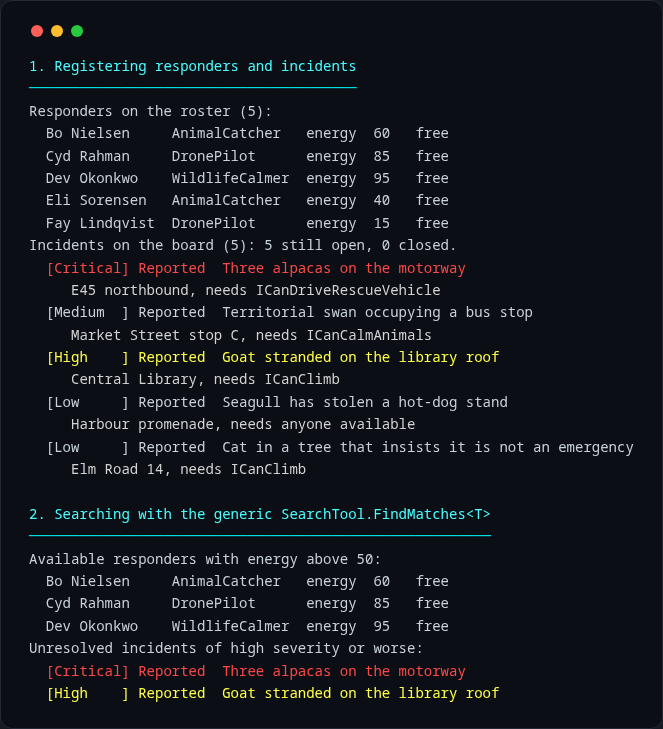
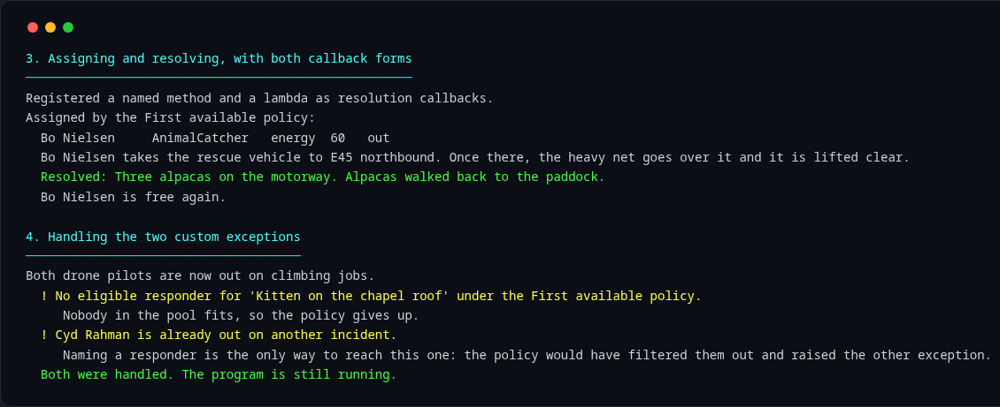
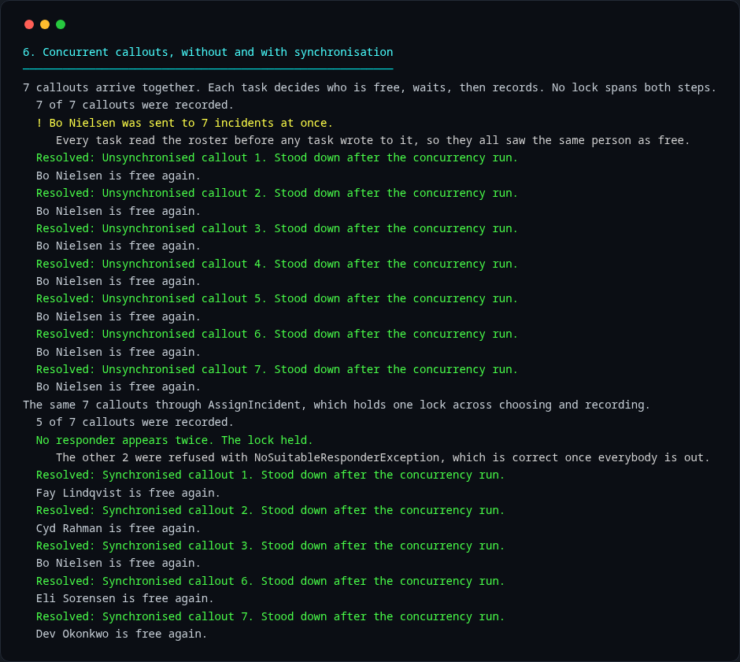
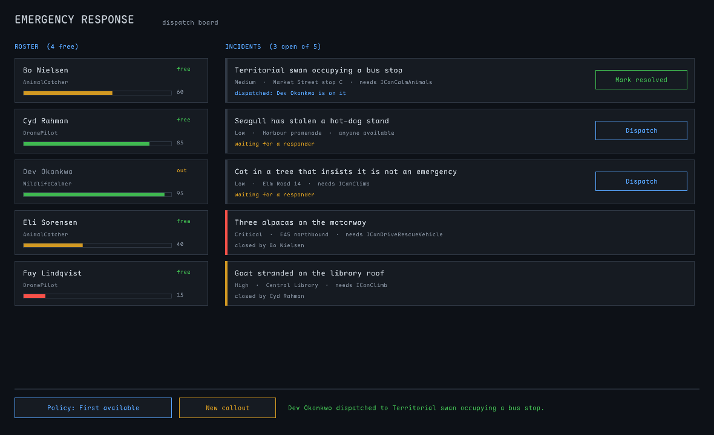

# Emergency Response

A command centre for the municipal Emergency Response Unit, which exists because
a goat got onto the library roof and the paper rota sent the same person to two
places at once.

A C# console application: responders with skills, incidents with requirements, a
single command centre that matches them up without double-booking anybody.



## Running it

Needs the [.NET 10 SDK](https://dotnet.microsoft.com/download).

```bash
dotnet build          # 0 warnings, or it fails: see "Warnings are errors"
dotnet test           # 92 tests
dotnet run --project src/EmergencyResponse.ConsoleDemo
```

The demo is scripted, not interactive. It prints seven sections: the roster, a
generic search, a callout handled end to end, two failures handled cleanly, the
assignment policy being swapped, a race condition and its fix, and the board at
the end of the shift.

## The design

[**Read the class diagram**](docs/UML.md). GitHub renders it inline.

Two projects. `EmergencyResponse.Core` holds the domain and knows nothing about
consoles. `EmergencyResponse.ConsoleDemo` is the only thing that prints.

```
src/EmergencyResponse.Core/          domain, rules, the command centre
src/EmergencyResponse.ConsoleDemo/   the scripted demonstration
tests/EmergencyResponse.Tests/       92 tests
```

### Why the command centre is a singleton

There is one municipal coordination centre in real life, so there is one here.
A second instance would keep its own view of who is busy, which is the exact
failure the paper rota had. The constructor is private, the only way in is
`CommandCentre.GetInstance(strategy)`, and creation is guarded by a static lock
so the concurrency demo cannot accidentally produce two.

Calling `GetInstance(strategy)` a second time throws rather than quietly
ignoring the new policy. We do this because silently discarding an argument hides bugs.

### Who knows who is busy

Neither the responder nor the incident. `CommandCentre` owns a
`Dictionary<Incident, Responder>`, and availability is **derived** from it: a
responder is free when no unresolved incident names them.

### Access modifiers

`Energy` has a private setter. `AdjustEnergy`, `MarkAssigned` and `Resolve` are
`internal`, so only `Core` can drive the lifecycle. The console can ask
questions and issue commands; it cannot reach in and set a field. Energy is
valid from **0 to 100** inclusive, `AdjustEnergy` clamps rather than throwing (a brutal callout should exhaust somebody, but not crash the dispatch), and a responder on 0 takes no new work.

### Collections

`List<Responder>` and `List<Incident>`, because order carries meaning:
responders stay in registration order, which is what gives
`FirstAvailableStrategy` a stable definition of "first", and incidents stay in
report order. A `Dictionary` keyed by name would lose that and would wrongly
imply names are unique. Both lists are private, and every read hands back a
snapshot copy taken under the lock, so nothing can enumerate one while another
thread appends to it.

### Skills are interfaces, not subclasses

`ICanClimb`, `ICanOperateDrone`, `ICanCalmAnimals`, `ICanDriveRescueVehicle`.
An incident declares what it needs, `Responder.CanHandle` checks it, and nobody carries a method that makes no sense for them.

### Swapping the assignment policy

`CommandCentre` never names a concrete strategy. It takes an
`IAssignmentStrategy` on creation and `ChangeStrategy` replaces it, which is the mechanism the demo uses (the singleton rules out simply building a second
centre). Same centre, same roster, different answer:

```
Policy "First available" picks:        Bo Nielsen      energy  28
Policy "Highest energy available":     Dev Okonkwo     energy  95
```

`CommandCentre.cs` is not touched between those two lines.

**Why that makes the selection logic easier to change later.** The centre depends
on the interface and never on an algorithm, so changing how a responder is chosen and changing how the centre works are two different jobs in two different files. 
A new policy is a new class: nothing that already works gets edited, and we wont have to grow a `switch` inside the centre for every new rule that get's added. 
The parts that must nt break are the locking, the assignment record and the guards, and a policy change never touches them, so the no-double-booking guarantee does not have to be proved
again every time the selection rule changes. The field is typed `IAssignmentStrategy` so the compiler will not let the centre depend on a concrete strategy by accident.

## Callbacks



Resolving an incident fires every registered `ResolutionCallback`, in
registration order. The demo registers two: a named method that logs the
outcome, and a lambda that reports who is free again. The callbacks are copied
under the lock and invoked outside it, because they are host code and running
arbitrary work while holding a lock is how you get a deadlock.

## The race condition



Seven callouts arrive at once, twice.

**Without synchronisation**, each task asks who is free, and only afterwards
records its choice. Every task reads the roster before any task writes to it, so they all see the same person as available and all seven land on Bo Nielsen. 
Note that this is not a missing lock. The dictionary write *is* locked. What is
missing is a lock spanning **both** steps, so another thread slips into the gap
between deciding and recording. Individually safe operations do not compose into
a safe operation.

**With synchronisation**, the same seven go through `AssignIncident`, which
holds one lock across choosing AND recording:

```csharp
lock (assignmentLock)
{
    EnsureIncidentIsOpen(incident);
    Responder chosen = assignmentStrategy.SelectResponder(AvailableRespondersNoLock(), incident);
    Record(incident, chosen);
}
```

Five callouts go to five different people and two are refused with
`NoSuitableResponderException`, which is correct once everybody is out. No
responder can be in two places, because no other thread can observe the roster
between the decision and the record.

The concurrency lives in the host: `Main` is `async Task`, the callouts start
together and are awaited with `Task.WhenAll`. `CommandCentre` stays synchronous
on purpose, because you cannot `await` inside a `lock`.

The one `Task.Delay` in the solution widens the race window so the failure is
observable. It is in the demonstration and nowhere near `Core`.

## A second UI



`src/EmergencyResponse.RaylibUi` is a desktop window built with
[raylib-cs](https://github.com/chrisdill/raylib-cs). It references `Core` and
nothing else, and shares no code with the console. Click a responder to send
them by name, or dispatch by policy. Swap the policy, call in new incidents,
close them off.

It is here as proof that `Core` is not entangled with the console: both hosts
get a string back from `HandleIncident`, one writes it and the other draws it.
The console demonstration is still the canonical showcase.

```bash
dotnet run --project src/EmergencyResponse.RaylibUi
```

Bundles Maple Mono NF under the SIL Open Font License 1.1.

## Warnings are errors

`TreatWarningsAsErrors` is on, and `.editorconfig` promotes the naming rules to
errors via `IDE1006`. So a missing XML doc comment, a nullability warning or a
stray `_underscored` field breaks the build rather than accumulating quietly.
