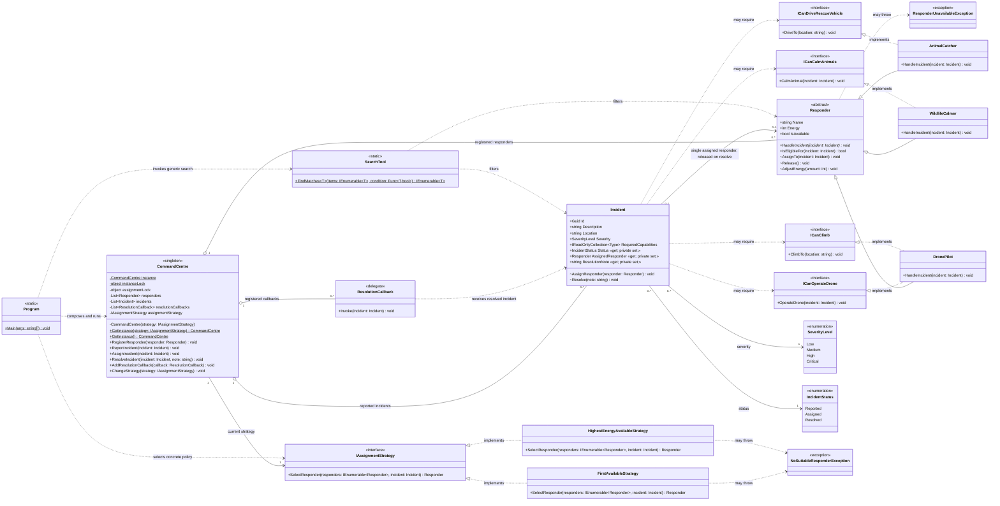

# UML class diagram

The diagram uses UML-style visibility (`+` public, `-` private, `#` protected,
`~` package/internal),
generalization, interface realization, aggregation, association, and dependency
arrows. Multiplicities label both ends of relationships. Method bodies are
intentionally omitted.

`CommandCentre` has two separate locks by design: `instanceLock` makes
singleton construction thread-safe, while `assignmentLock` atomically selects
and reserves a responder and synchronizes a strategy replacement. The
`ChangeStrategy` operation is the chosen way to demonstrate both assignment
policies while retaining exactly one command centre.
