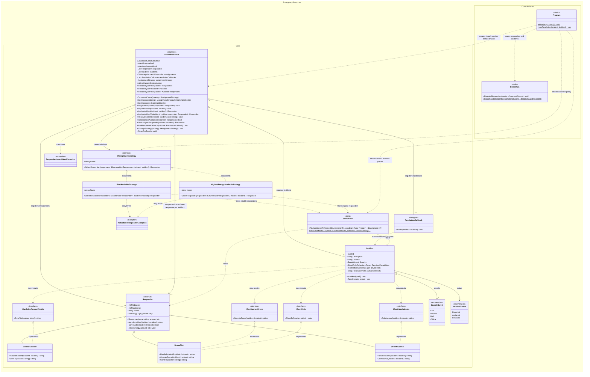

# UML class diagram

[Read the project README](README.md)

```mermaid
classDiagram
    direction LR

    namespace EmergencyResponse.Core {
        class Responder {
            <<abstract>>
            +int MinEnergy$
            +int MaxEnergy$
            +string Name
            +int Energy «get; private set;»
            #Responder(name: string, energy: int)
            +HandleIncident(incident: Incident) string*
            +CanHandle(incident: Incident) bool
            ~AdjustEnergy(amount: int) void
        }

        class AnimalCatcher {
            +HandleIncident(incident: Incident) string
            +DriveTo(location: string) string
        }
        class DronePilot {
            +HandleIncident(incident: Incident) string
            +OperateDrone(incident: Incident) string
            +ClimbTo(location: string) string
        }
        class WildlifeCalmer {
            +HandleIncident(incident: Incident) string
            +CalmAnimal(incident: Incident) string
        }

        class Incident {
            +Guid Id
            +string Description
            +string Location
            +SeverityLevel Severity
            +IReadOnlyCollection~Type~ RequiredCapabilities
            +IncidentStatus Status «get; private set;»
            +string ResolutionNote «get; private set;»
            ~MarkAssigned() void
            ~Resolve(note: string) void
        }

        class CommandCentre {
            <<singleton>>
            -CommandCentre instance$
            -object instanceLock$
            -object assignmentLock
            -List~Responder~ responders
            -List~Incident~ incidents
            -Dictionary~Incident,Responder~ assignments
            -List~ResolutionCallback~ resolutionCallbacks
            -IAssignmentStrategy assignmentStrategy
            -CommandCentre(strategy: IAssignmentStrategy)
            +GetInstance(strategy: IAssignmentStrategy) CommandCentre$
            +GetInstance() CommandCentre$
            +string CurrentStrategyName
            +IReadOnlyList~Responder~ Responders
            +IReadOnlyList~Incident~ Incidents
            +IReadOnlyList~Responder~ AvailableResponders
            +RegisterResponder(responder: Responder) void
            +ReportIncident(incident: Incident) void
            +AssignIncident(incident: Incident) Responder
            +AssignIncidentTo(incident: Incident, responder: Responder) Responder
            +ResolveIncident(incident: Incident, note: string) void
            +IsResponderAvailable(responder: Responder) bool
            +GetAssignedResponder(incident: Incident) Responder
            +AddResolutionCallback(callback: ResolutionCallback) void
            +ChangeStrategy(strategy: IAssignmentStrategy) void
            ~ResetForTests() void$
        }

        class IAssignmentStrategy {
            <<interface>>
            +string Name
            +SelectResponder(responders: IEnumerable~Responder~, incident: Incident) Responder
        }
        class FirstAvailableStrategy {
            +string Name
            +SelectResponder(responders: IEnumerable~Responder~, incident: Incident) Responder
        }
        class HighestEnergyAvailableStrategy {
            +string Name
            +SelectResponder(responders: IEnumerable~Responder~, incident: Incident) Responder
        }

        class ICanOperateDrone {
            <<interface>>
            +OperateDrone(incident: Incident) string
        }
        class ICanCalmAnimals {
            <<interface>>
            +CalmAnimal(incident: Incident) string
        }
        class ICanClimb {
            <<interface>>
            +ClimbTo(location: string) string
        }
        class ICanDriveRescueVehicle {
            <<interface>>
            +DriveTo(location: string) string
        }

        class SearchTool {
            <<static>>
            +FindMatches~T~(items: IEnumerable~T~, condition: Func~T,bool~) IEnumerable~T~$
            +FindFirstMatch~T~(items: IEnumerable~T~, condition: Func~T,bool~) T$
        }
        class ResolutionCallback {
            <<delegate>>
            +Invoke(incident: Incident) void
        }
        class SeverityLevel {
            <<enumeration>>
            Low
            Medium
            High
            Critical
        }
        class IncidentStatus {
            <<enumeration>>
            Reported
            Assigned
            Resolved
        }
        class ResponderUnavailableException {
            <<exception>>
        }
        class NoSuitableResponderException {
            <<exception>>
        }
    }

    namespace EmergencyResponse.ConsoleDemo {
        class Program {
            <<static>>
            +Main(args: string[]) void$
            -LogResolution(incident: Incident) void$
        }
        class DemoData {
            <<static>>
            +RegisterResponders(centre: CommandCentre) void$
            +ReportIncidents(centre: CommandCentre) IReadOnlyList~Incident~$
        }
    }

    Responder <|-- AnimalCatcher
    Responder <|-- DronePilot
    Responder <|-- WildlifeCalmer

    ICanDriveRescueVehicle <|.. AnimalCatcher : implements
    ICanOperateDrone <|.. DronePilot : implements
    ICanClimb <|.. DronePilot : implements
    ICanCalmAnimals <|.. WildlifeCalmer : implements

    IAssignmentStrategy <|.. FirstAvailableStrategy : implements
    IAssignmentStrategy <|.. HighestEnergyAvailableStrategy : implements

    CommandCentre "1" o-- "0..*" Responder : registered responders
    CommandCentre "1" o-- "0..*" Incident : reported incidents
    CommandCentre "1" o-- "0..*" ResolutionCallback : registered callbacks
    CommandCentre "1" --> "1" IAssignmentStrategy : current strategy
    CommandCentre "1" --> "0..*" Responder : assignment record, one responder per incident
    Incident "0..*" --> "1" SeverityLevel : severity
    Incident "0..*" --> "1" IncidentStatus : status
    ResolutionCallback ..> Incident : receives resolved incident
    Incident ..> ICanOperateDrone : may require
    Incident ..> ICanCalmAnimals : may require
    Incident ..> ICanClimb : may require
    Incident ..> ICanDriveRescueVehicle : may require
    CommandCentre ..> ResponderUnavailableException : may throw
    FirstAvailableStrategy ..> NoSuitableResponderException : may throw
    HighestEnergyAvailableStrategy ..> NoSuitableResponderException : may throw
    FirstAvailableStrategy ..> SearchTool : filters eligible responders
    HighestEnergyAvailableStrategy ..> SearchTool : filters eligible responders
    SearchTool ..> Responder : filters
    SearchTool ..> Incident : filters


    Program ..> CommandCentre : creates it and runs the demonstration
    Program ..> IAssignmentStrategy : selects concrete policy
    Program ..> DemoData : seeds responders and incidents
    Program ..> SearchTool : responder and incident queries
```